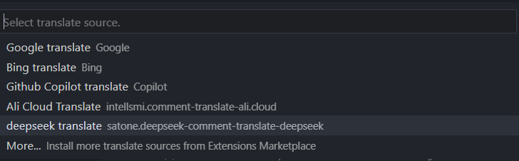

# DeepSeek 智能注释翻译插件

本插件为「Comment Translate」提供DeepSeek的翻译源支持，需配合主插件使用。

## 功能特点

1. 支持DeepSeek官方API和Ollama本地部署两种模式
2. 提供智能的代码注释翻译能力
3. 自动检测API连接状态
4. 实时显示翻译服务响应时间

## 使用要求

需先安装 [Comment Translate 插件](https://marketplace.visualstudio.com/items?itemName=intellsmi.comment-translate)

## 使用指南

1. 安装后通过命令面板调用「切换翻译源」功能
    
2. 选择「DeepSeek Translate」并配置API参数
    
3. 在代码编辑器中直接使用翻译功能（快捷键：`Ctrl+Shift+T`）

## 配置说明

本插件提供以下配置项：

* `deepseekTranslate.authKey`: DeepSeek API认证密钥（云端API必填）
* `deepseekTranslate.apiType`: API类型选择 `openai`(默认)/`ollama`（本地部署）
* `deepseekTranslate.apiBaseUrl`: API基础地址（默认：`https://api.deepseek.com`，Ollama用户设为`http://localhost:11434`）
* `deepseekTranslate.model`: 模型名称（默认：`deepseek-chat`，Ollama用户填写本地模型名）

提醒：
- 建议配置、使用deepseek-v3等不包含思维链的模型，响应速度更理想
- 经测试，v3响应速度远比包含思维链的r1蒸馏模型更快
- 其他非deepseek系列模型也可以通过这些配置项进行配置

## 配置示例

### 使用官方API（默认配置）
```json
{
    "deepseekTranslate.authKey": "您的API密钥",
}
```

### 本地Ollama部署
```json
{
    "deepseekTranslate.apiType": "ollama",
    "deepseekTranslate.apiBaseUrl": "http://localhost:11434",
    "deepseekTranslate.model": "您本地的模型名称"
}
```

### 自定义API端点
```json
{
    "deepseekTranslate.authKey": "自定义API密钥",
    "deepseekTranslate.apiType": "openai",
    "deepseekTranslate.apiBaseUrl": "https://您的自定义API地址/",
    "deepseekTranslate.model": "自定义模型名称"
}
```

## 注意事项

1. Ollama模式要求：
   - 需本地安装 [Ollama](https://ollama.ai/)
   - 无需配置authKey
   - 模型名称需与本地安装的模型一致
2. 云端API用户必须配置有效的authKey
3. 配置保存后会自动进行连接测试，请留意弹框提示
4. `apiBaseUrl`会根据您配置的`apiType`自动拼接`apiType == "ollama" ? "/api/generate" : "/chat/completions"`，请注意不要重复
